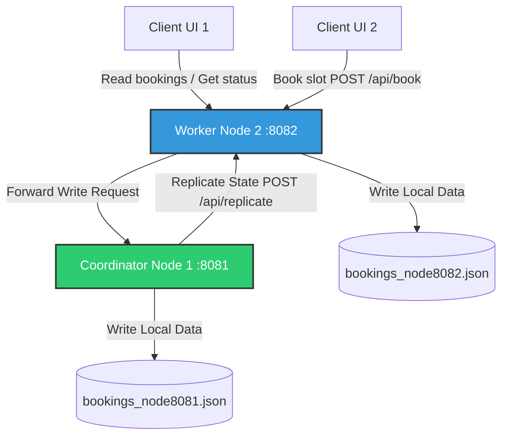

# PROJECT REPORT
## Distributed Campus Sports Facility Booking System

---

### 1. Introduction & Problem Statement

#### 1.1 Introduction
In modern academic environments, sports facilities (e.g., badminton, basketball, football, and volleyball courts) are highly sought after by students and faculty. Managing bookings for these facilities requires a system that is highly available, consistent, and capable of handling concurrent access without permitting duplicate bookings (race conditions).

#### 1.2 Problem Statement
Traditional centralized booking systems face several challenges when subjected to heavy, concurrent user traffic (e.g., when booking slots open at a specific time):
1. **Single Point of Failure (SPOF):** If a single centralized booking server crashes, the entire facility booking service becomes unavailable to the campus community.
2. **Race Conditions and Double Booking:** Without strict concurrency control, multiple clients sending requests simultaneously for the same slot can result in double bookings, leading to operational chaos.
3. **Read/Write Bottlenecks:** A centralized database must handle both high-frequency reads (users constantly checking slot availability) and writes (users booking slots), causing performance degradation during peak hours.
4. **Data Sync & Hard Restarts:** Periodically resetting bookings manually or handling daily schedules across multiple independent systems often leads to inconsistent states and high administrative overhead.

---

### 2. Project Objectives

The primary objective of this project is to design, implement, and verify a robust, distributed booking system for campus sports facilities that addresses the shortcomings of centralized systems. Specifically, the system aims to:
- **Ensure High Availability and Fault Tolerance:** Implement a primary-backup architecture that dynamically promotes worker nodes to coordinator status if the primary coordinator fails, minimizing downtime.
- **Enforce Strict Concurrency Control:** Apply First-Come-First-Serve (FCFS) booking logic utilizing synchronized operations to guarantee that double booking is impossible.
- **Provide Scalable Read Access:** Allow worker nodes to serve read requests (`GET /api/bookings`) directly from their local data caches, offloading traffic from the coordinator.
- **Automate System Maintenance:** Implement background schedulers for automated, coordinated daily resets of booking slots.
- **Deliver an Intuitive User Experience:** Build a clean, responsive frontend web interface displaying live node statuses, real-time booking grids, and interactive, color-coded slots.

---

### 3. System Features

The system offers a comprehensive suite of features tailored for campus sports facility management:

1. **Multi-Court Visual Grid:** Supports multiple distinct sports courts (Badminton, Basketball, Football, Volleyball) with real-time slot statuses (Available, Booked by Others, Booked by You).
2. **First-Come-First-Serve (FCFS) Booking:** Booking requests are processed in the order they reach the server. The first thread to acquire the lock wins, and subsequent attempts receive clear rejection alerts.
3. **Fair-Use Constraints:** Users are strictly restricted to a maximum of **2 slots per court per day** to prevent reservation hoarding and ensure fair distribution.
4. **Robust Identification Check:** Validates user credentials. Usernames must match the campus ID pattern (exactly 6 digits, optionally prefixed with a case-insensitive "BC").
5. **Passive Write Replication:** Updates are made at the Coordinator and replicated asynchronously to all registered Worker nodes to maintain eventual consistency.
6. **Automatic Failover & Dynamic Promotion:** Worker nodes automatically detect if the coordinator is down during write operations, dynamically promoting themselves to Coordinator to continue processing writes locally.
7. **Automated Midnight Reset:** An internal Java scheduler monitors local time and resets booking files to clear all reservations at midnight daily.

---

### 4. System Design & Architectural Concept

The system is built on a **Distributed Primary-Backup (Coordinator-Worker)** architecture. 

#### 4.1 Topology & Roles


* **Coordinator Node (Primary):**
  - Acts as the single point of serialization for all booking write operations.
  - Validates and writes data to its local storage (`bookings_node8081.json`).
  - Asynchronously propagates state updates to all workers.
* **Worker Nodes (Secondary / Backup):**
  - Serve all local read requests (`GET /api/bookings`) instantly.
  - Forward write requests (`POST /api/book`) to the coordinator.
  - Keep their local JSON files in sync via the `/api/replicate` endpoint.
  - Monitor the coordinator's health during write forwarding to trigger failover.

#### 4.2 Concurrency Control & Mutex Theory
To prevent race conditions, the `BookingManager` class acts as a monitor utilizing Java's intrinsic locks (`synchronized` keyword). 
- When a booking request arrives, the thread must acquire the monitor lock for the booking object.
- The check-then-act sequence (verifying if a slot is null, counting user bookings, and updating the state) is executed atomically.
- This represents a strict Mutex (Mutual Exclusion) pattern, ensuring only one booking transaction is processed at any given instant.

#### 4.3 Replication Model
- **Passive Replication:** The coordinator performs the write transaction first. Once successful, it dispatches HTTP POST payloads containing the complete JSON state to the worker nodes.
- **Asynchronous Execution:** Replication is executed within a spawned daemon thread (`new Thread(...)`). This ensures the client's network call returns immediately without waiting for replication across the entire cluster, lowering write latency.

#### 4.4 Failover Mechanism (Dynamic Promotion)
If a worker node detects a connection failure (e.g., `java.net.ConnectException`) when forwarding a booking request to the coordinator:
1. It catches the network exception.
2. It executes a failover routine: prints a promotion banner to the system console.
3. It modifies its internal role state variable from `"worker"` to `"coordinator"`.
4. It bypasses the forwarding logic and commits the transaction directly to its own local data file.
5. From that point on, it operates as the new primary coordinator, replicating future transactions to any remaining nodes.

---

### 5. Detailed Methodology

The development process was executed in six sequential phases:

```
┌───────────────────────────────────────┐
│ Phase 1: Requirements & Architecture  │
└───────────────────┬───────────────────┘
                    ▼
┌───────────────────────────────────────┐
│ Phase 2: Core Server & Data Layer     │
└───────────────────┬───────────────────┘
                    ▼
┌───────────────────────────────────────┐
│ Phase 3: Communication & Replication  │
└───────────────────┬───────────────────┘
                    ▼
┌───────────────────────────────────────┐
│ Phase 4: Failover Logic & Promotion   │
└───────────────────┬───────────────────┘
                    ▼
┌───────────────────────────────────────┐
│ Phase 5: Client-Side UI & Integration │
└───────────────────┬───────────────────┘
                    ▼
┌───────────────────────────────────────┐
│ Phase 6: System Testing & Verification │
└───────────────────────────────────────┘
```

#### Phase 1: Requirements & Architecture
- Defined the data structures (Courts, Time slots).
- Formulated the distributed model (Coordinator-Worker setup).
- Standardized REST API endpoints (`/api/bookings`, `/api/book`, `/api/replicate`, `/api/status`).

#### Phase 2: Core Server & Data Layer Implementation
- Implemented `BookingServer.java` utilizing the built-in HTTP server (`com.sun.net.httpserver.HttpServer`).
- Designed `BookingManager.java` for data file I/O operations using custom JSON helper logic (`JsonHelper.java`).
- Implemented `synchronized` blocks around database writes to establish FCFS behavior and enforce user booking limits (max 2 slots per court).

#### Phase 3: Distributed Communication & Passive Replication
- Coded `NodeCommunicator.java` using `HttpURLConnection` to manage POST payloads.
- Configured worker nodes to forward all `/api/book` requests to the coordinator's URL.
- Structured the asynchronous replication loop inside the coordinator to broadcast the state updates.

#### Phase 4: Failover Logic & Resiliency Integration
- Wrapped forwarding operations in try-catch blocks.
- Programmed self-promotion logic so that workers switch their operating mode to `"coordinator"` upon detecting coordinator failures.
- Implemented `ScheduledExecutorService` in `BookingServer` to handle midnight schedule resets automatically on active coordinators.

#### Phase 5: Client-Side UI & Integration
- Created `web/index.html` consisting of CSS-styled cards mapping court availability.
- Wrote vanilla JavaScript functions to fetch status alerts and render button states dynamically.
- Configured status checks to display details of the target port and operational role directly to the user.

#### Phase 6: System Testing & Verification
- Simulated concurrent requests to verify thread safety.
- Stopped the coordinator process to observe self-promotion of worker nodes to coordinator status.
- Verified validation constraints (username formats and 2-slot limits).

---

### 6. Suggested User Interface Situations & Analysis

Here are the key user interface states designed to provide visibility into system operations:

#### Situation A: Initial Load & Node Status Verification
* **User Flow:** The user navigates to the application URL (e.g. `http://localhost:8082`).
* **UI Behavior:**
  - The top banner flashes "Connecting to server..." and is quickly replaced with a dark blue bar stating: **"Connected to Node on Port 8082 — Role: WORKER (Secondary Node)"** (or green if connected to port 8081).
  - The court cards load with color-coded slots.
* **Underlying Logic:** The client executes `fetchNodeStatus()` to query `/api/status`, discovering which node they are linked to and its operational role.

#### Situation B: Successful Slot Booking
* **User Flow:** A student inputs a valid ID (`BC123456`) and clicks an available slot button (e.g. `8:00 AM - 9:00 AM` on the Badminton Court).
* **UI Behavior:**
  - The browser displays a success prompt: `"Successfully booked Badminton court at 08:00!"`.
  - The button turns blue, the label changes to `8:00 AM - 9:00 AM ✓ You`, and the button is disabled.
* **Underlying Logic:** The POST request reaches the node, is validated, written, replicated to other nodes, and the UI triggers a re-fetch of the schedule.

#### Situation C: Rejecting Double Bookings (FCFS Enforcement)
* **User Flow:** User A and User B both view the page showing Badminton `09:00` as "Available". Both click the button almost simultaneously.
* **UI Behavior:**
  - User A's click arrives a split-second earlier and succeeds.
  - User B's click shows a red error dialog: `"Sorry, this slot was already booked by BC123456! Please refresh the page..."`.
  - The button on User B's UI turns red showing the slot is booked by User A.
* **Underlying Logic:** Thread synchronization locks the resource. The first thread changes the value. When the second thread attempts write access, the FCFS check rejects the operation since the slot value is no longer null.

#### Situation D: Enforcing Fair-Use Limits (Max 2 Slots)
* **User Flow:** A user attempts to book a 3rd slot on the same court in a single day.
* **UI Behavior:**
  - The booking is rejected with an alert message: `"You have already booked the maximum of 2 slots for Volleyball Court today."`
* **Underlying Logic:** The `BookingManager` scans the specific court's slots array, counts matches of the user's ID, and blocks bookings when the count equals 2.

#### Situation E: Fault Tolerance and Automatic Failover
* **User Flow:** The primary Coordinator (`Node 8081`) crashes. A user connected to Worker (`Node 8082`) tries to book a slot.
* **UI Behavior:**
  - The user experiences a slight delay (network timeout check).
  - The booking completes successfully.
  - The top banner dynamically updates to: **"Connected to Node on Port 8082 — Role: COORDINATOR (Primary Node)"**.
  - The server console prints the failover sequence: `[FAILOVER] Promoting Node on port 8082 to COORDINATOR!`.
* **Underlying Logic:** The worker's node communicator catches the network error, triggers promotion, handles the write locally, and updates its status role.

---

### 7. Conclusion & Future Outlook

#### 7.1 Conclusion
The Distributed Campus Sports Facility Booking System successfully addresses the core vulnerabilities of centralized booking infrastructures. By adopting a **Coordinator-Worker** model with **Passive Write Replication** and **Dynamic Self-Promotion (Failover)**, the system achieves:
1. **High Availability:** Services remain online even in the event of primary node failures.
2. **Deterministic Concurrency Control:** Intrinsic locks prevent race conditions, guaranteeing FCFS execution.
3. **Optimized Read Scalability:** Local caches allow secondary nodes to handle query loads, minimizing coordinator bottlenecking.
4. **Seamless System State Alignment:** Automated daily reset tasks ensure clean daily databases without manual intervention.

#### 7.2 Future Outlook & Enhancements
To scale this proof-of-concept into a enterprise-grade solution, several enhancements are proposed:
* **Consensus Algorithm Integration:** Implement Raft or Paxos protocols to elect new leaders dynamically in multi-node clusters, avoiding potential split-brain issues.
* **Partition Tolerance:** Introduce vector clocks and conflict-resolution strategies to allow nodes to operate independently during network partitions and merge data upon reconnection.
* **Persistent DB Integration:** Replace JSON file-based storage with distributed transaction databases (e.g., PostgreSQL with replication or CockroachDB).
* **Enhanced Authentication:** Secure the system using token-based OAuth2/OIDC campus single sign-on (SSO).
